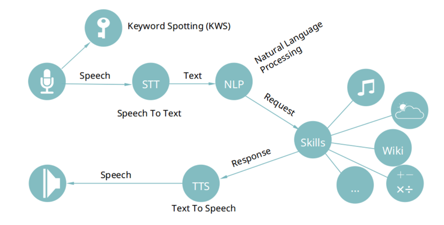

Introduction  
============  

  

Keyword Search/Keyword Spotting(KWS) / Wake-up words detection
==========  
- [Mycroft Precise](https://github.com/MycroftAI/mycroft-precise)  
- [Software Comparison](https://github.com/MycroftAI/mycroft-precise/wiki/Software-Comparison)  
- [Project Alias 2.0](https://github.com/bjoernkarmann/project_alias)  
- [How to use Alias](https://www.androidpolice.com/2019/01/14/this-google-home-and-amazon-echo-hack-lets-you-change-your-voice-ai-hotword-but-its-far-from-elegant/)  

Speech To Text (STT)  
====================  
- [Mozila DeepSpeech Github](https://github.com/mozilla/DeepSpeech)  
- [Mozila DeepSpeech Blog](https://research.mozilla.org/machine-learning/)  
- [DeepSpeech Examples](https://github.com/mozilla/DeepSpeech-examples)  
- [DeepSpeech Paper by Baidu, Dec 2014](https://arxiv.org/pdf/1412.5567.pdf)  
- [A Journey to <10% with DeepSpeech, Nov 2017](https://hacks.mozilla.org/2017/11/a-journey-to-10-word-error-rate/)  

Natural Languge Processing /Chatbot
====================================  
- [ABERT Blog](https://ai.googleblog.com/2019/12/albert-lite-bert-for-self-supervised.html)  
- [ABERT Github](https://github.com/google-research/ALBERT)  
- [2020 Top 10 NLP Courses](https://favouriteblog.com/natural-language-processing-nlp-online-course/?fbclid=IwAR3PmmSkFrA3Oj3jOdF5xslDbD2KxGG8ziDL5ugAbI9ac9GizcouotGd6TM)   
- [NLP with RNNs and Attention](https://github.com/ageron/handson-ml2/blob/master/16_nlp_with_rnns_and_attention.ipynb)  
- [한글 띄어쓰기 처리, 2018](https://lovit.github.io/nlp/2018/04/25/soyspacing/?fbclid=IwAR1SzV4D4rqYa39KLk2vKi-k2unwH9nqSieVcAWuIdOjQ6GizWkdmjqA8Mo)  

Text To Speech (TTS)  
====================  

- [Mozila TTS](https://github.com/mozilla/TTS)  
- [Deep Voice, Mar 2017](https://arxiv.org/pdf/1702.07825.pdf)  

Articles  
================ 

- [2019 Guide to Speech Synthesis](https://heartbeat.fritz.ai/a-2019-guide-to-speech-synthesis-with-deep-learning-630afcafb9dd)  
- [6 Important Speech Recognition Technology You should Know](https://www.seeedstudio.com/blog/2018/11/23/6-important-speech-recognition-technology-you-need-to-know/)  
- [음성인식 기술 소개, 2016년](http://www.itdaily.kr/news/articleView.html?idxno=76405)  

Reference  
==========  

- [Free WAV files](https://www.thefreesite.com/free_sounds/free_wavs/)  
- [Wav Converter](https://audio.online-convert.com/convert-to-wav)  
- [Google Dataset Search](https://www.zoominlife.com/1614?fbclid=IwAR0GbTzE87Zt3DnhQCoAalmFQw8-Gv7H4NPMzk1NNQ0I2QeZtHnH-FtkE7Q)  
